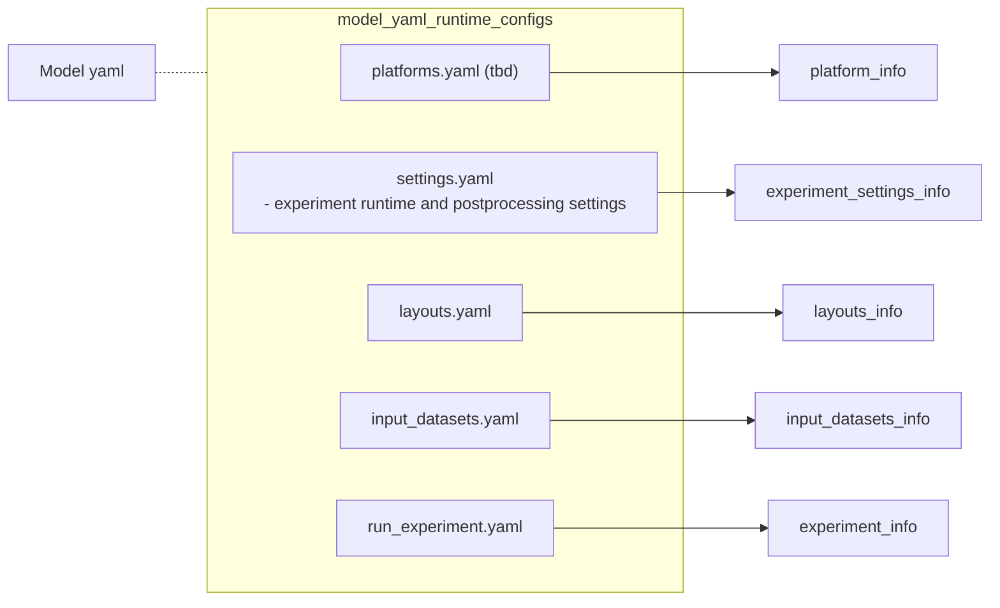

## fre run
This tool is still under development and not yet ready for use

## YAML configurations
- `model.yaml`
- `layouts.yaml`
- `input_datasets.yaml`
- `settings.yaml`
- `runtime_experiment.yaml`

